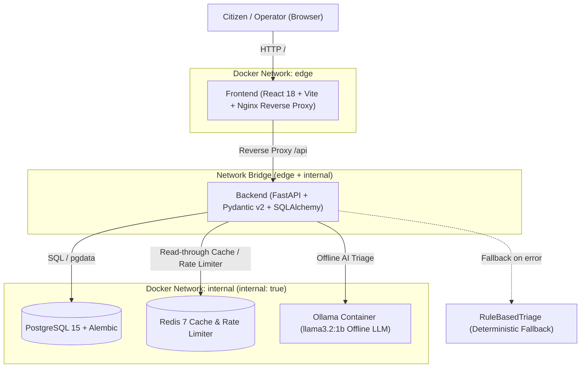

# CivicPulse — Municipal Complaint Intake & AI Triage Platform

[](https://github.com/your-org/civicpulse/actions/workflows/ci.yml)
[](https://github.com/your-org/civicpulse/actions/workflows/cd.yml)
[](LICENSE)
[](https://python.org)
[](https://nodejs.org)
[](https://docker.com)
[](https://kubernetes.io)

CivicPulse is an end-to-end municipal incident intake, automated AI triage, and public works operations platform. It eliminates manual triage bottlenecks by analyzing unstructured citizen reports, predicting operational categories, assigning priority levels, generating executive summaries, and dispatching issues through a strict state machine.

---

## 1. System Architecture



---

## 2. One-Command Quickstart

To launch the complete 5-container architecture on your local machine:

```bash
# 1. Clone repository
git clone https://github.com/your-org/civicpulse.git
cd civicpulse

# 2. Setup environment variables
cp .env.example .env

# 3. Launch Docker Compose stack
docker compose up -d

# 4. Populate idempotent sample complaints (>= 30 Urdu-influenced English entries)
docker compose exec backend python scripts/seed.py
```

- **Frontend Application:** [http://localhost:8080](http://localhost:8080)
- **API Documentation (Swagger UI):** [http://localhost:8000/docs](http://localhost:8000/docs)
- **Metrics Endpoint:** [http://localhost:8000/metrics](http://localhost:8000/metrics)
- **Readiness Probe:** [http://localhost:8000/ready](http://localhost:8000/ready)

---

## 3. API Contract Specification

| Method | Endpoint | Description | Status Codes |
| :--- | :--- | :--- | :--- |
| `POST` | `/api/complaints` | Validate $\rightarrow$ AI Triage $\rightarrow$ Persist complaint. Rate limited. | `201 Created`, `400 Bad Request`, `429 Too Many Requests` |
| `GET` | `/api/complaints/{id}` | Retrieve individual complaint details by UUID. | `200 OK`, `404 Not Found` |
| `GET` | `/api/complaints` | Paginated, filterable complaints list (`category`, `priority`, `status`). | `200 OK` |
| `PATCH` | `/api/complaints/{id}/status` | Enforce explicit state machine status transition. | `200 OK`, `404 Not Found`, `409 Conflict` |
| `GET` | `/api/stats` | Aggregated metrics cached in Redis for 30s. Includes `X-Cache: HIT\|MISS`. | `200 OK` |
| `GET` | `/api/meta/providers` | Observability endpoint: active triage provider and rolling audit log. | `200 OK` |
| `GET` | `/health` | Kubernetes Liveness Probe. Lightweight process health check (zero DB touch). | `200 OK` |
| `GET` | `/ready` | Kubernetes Readiness Probe. Checks PostgreSQL and Redis connectivity. | `200 OK`, `503 Service Unavailable` |
| `GET` | `/metrics` | Prometheus metrics: request counter, latency histograms, fallback rate. | `200 OK` |

---

## 4. Key Architectural Highlights

- **Replaceable AI Triage Layer (ADR 0001):** Pluggable strategy pattern supporting Hosted LLMs (`Groq`, `OpenRouter`), local offline models (`Ollama` running `llama3.2:1b`), CI fakes (`SimulatedTriage`), and rule-based fail-safe execution (`RuleBasedTriage`).
- **Resilience Circuit Breaker:** 10s strict timeout cap and single jittered retry on transient network errors. On persistent error, automatically degrades to `rules:fallback` without returning HTTP 500 to citizens.
- **Content-Hash Caching:** Duplicate complaints are hashed with SHA-256 and cached in Redis with a 24-hour TTL, serving duplicates in $\le 2\text{ ms}$ with zero redundant model inferences.
- **Strict Network Segmentation:** Frontend has zero physical network route to the PostgreSQL database or Redis cache (`docker compose exec frontend ping database` provably fails).
- **Zero-Bake Frontend Runtime Config (ADR 0002):** API paths are relative `/api/` reverse-proxied via Nginx, producing an immutable container image deployable to any environment.
- **Declarative Kubernetes Architecture:** Full Kustomize overlays (`dev` and `prod`), StatefulSet with `volumeClaimTemplates` for PostgreSQL, HorizontalPodAutoscaler (HPA v2), VerticalPodAutoscaler (VPA in recommend-only mode), and PodDisruptionBudgets.

---

## 5. Verification & Submission Lint

Run the mechanical lint before submission:
```bash
python scripts/check_submission.py
```